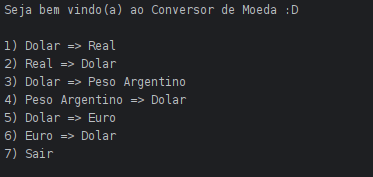

# 💱 Conversor de Moedas - Java

Projeto simples em Java para conversão de moedas utilizando a [ExchangeRate-API](https://www.exchangerate-api.com/). A aplicação é executada via terminal e permite converter valores entre Dólar, Real, Euro e Peso Argentino.

## ✅ Funcionalidades

- Conversão entre:
  - USD ⇄ BRL
  - USD ⇄ ARS
  - USD ⇄ EUR
- Interface interativa via terminal
- Consumo de API com HTTP Client nativo do Java
- Parsing de JSON com Gson

## 🧰 Requisitos

- Java 11 ou superior  
- Biblioteca [Gson](https://github.com/google/gson) (ex: gson-2.13.1.jar)  
- Conexão com a internet

## ▶️ Como usar

Compile e execute o projeto normalmente, em uma IDE ou pelo terminal, com o `gson` incluído no classpath.

## 📝 Licença

Este projeto está sob a licença MIT.

## 👤 Autor

Feito por **Nicholas Thaylor**  
🔗 Linkedin: (https://linkedin.com/in/nicholas-thaylor)
